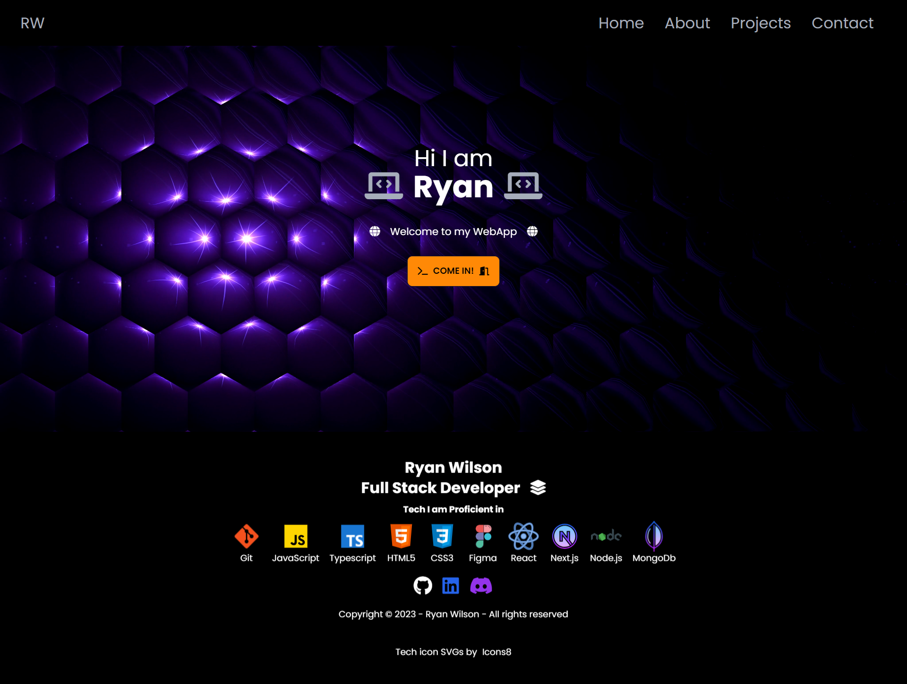

# 🌟 NextPort 2023 Portfolio Website 🌟

## 📑 Overview

NextPort 2023 is a portfolio website built with Next.js 13. It showcases projects, skills, and other professional information. The site is designed to be fast, responsive, and user-friendly.

🔗 [Live Site](https://nextport2023.netlify.app/)

## 🚀 Features

- 📱 Responsive design
- ⚡ Fast page loads
- 🖥️ Client-side rendering with Next.js 13
- 🎨 Tailwind CSS for styling
- 🍔 Custom Navbar with Hamburger Menu

## 🛠️ Installation

1. 📂 Clone the repository
[git clone](https://github.com/yourusername/nextport2023.git)

2. 🚀 Navigate to the project directory
3. 📦 Install dependencies
4. 🌐 Run the development server

## 🤝 Contributing

Contributions are welcome! Feel free to open an issue or create a pull request.

1. 🍴 Fork the repository
2. 🌿 Create a new branch (`git checkout -b new-feature`)
3. 💾 Commit your changes (`git commit -m 'Add some feature'`)
4. 📤 Push to the branch (`git push origin new-feature`)
5. 📬 Create a new Pull Request

## 📜 License

This project is open-source and available under the MIT License.

## 📞 Contact

For any questions or suggestions, please open an issue on GitHub.

